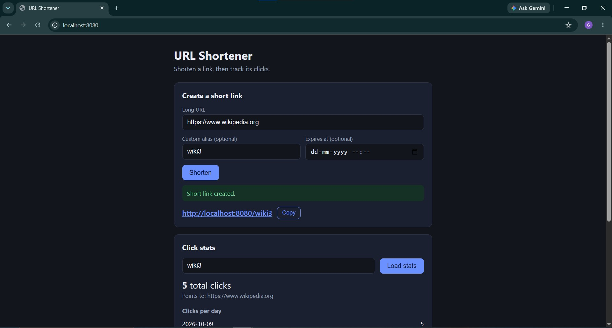
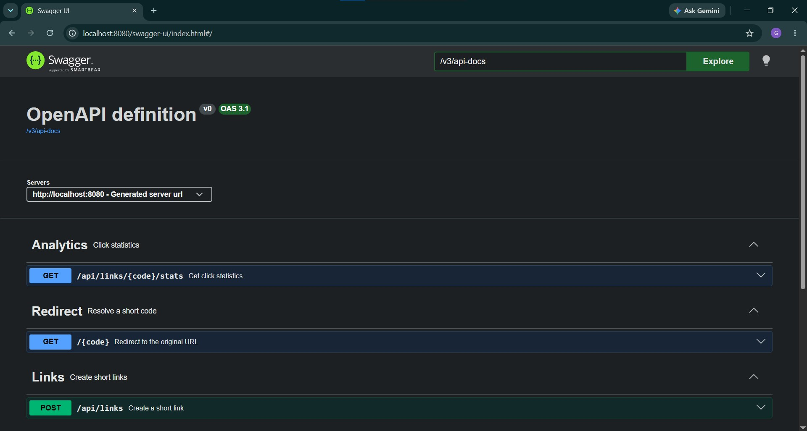

# URL Shortener with Click Analytics

A Java and Spring Boot application that shortens URLs, redirects visitors, and records
click analytics without slowing down the redirect. It includes a REST API, a simple
web UI, PostgreSQL persistence, and Redis caching.



## Features

- Create short links with auto-generated Base62 codes or custom aliases
- Optional link expiry (expired links return `410 Gone`)
- Fast `302` redirects; clicks are recorded asynchronously
- Redis caching of the redirect lookup (read-heavy path)
- Stats per link: total clicks, clicks per day, top referrers
- Simple web UI served by the app (no separate frontend build)
- Consistent JSON error responses with field-level validation messages
- Interactive Swagger docs and integration tests with MockMvc

## Tech stack

- Java 17+, Spring Boot 4.1, Spring Web MVC, Spring Data JPA, Bean Validation
- PostgreSQL (Docker profile) / H2 (default profile)
- Redis (Docker profile) / in-memory cache (default profile)
- Docker Compose, Lombok, springdoc-openapi
- JUnit 5 + MockMvc
- Plain HTML, CSS and JavaScript for the UI

## Run locally (no Docker)

Uses in-memory H2 and an in-memory cache, so data is lost on restart.

```bash
./mvnw spring-boot:run
```

(On Windows: `mvnw.cmd spring-boot:run`, or run `ShortenerLinkApplication` from your IDE.)

- Web UI: http://localhost:8080/
- Swagger UI: http://localhost:8080/swagger-ui.html
- H2 console: http://localhost:8080/h2-console (JDBC URL `jdbc:h2:mem:shortener`, user `sa`, blank password)

## Run with Docker (Postgres + Redis)

Start the database and cache:

```bash
docker compose up -d
```

Then start the app with the `docker` profile:

```bash
./mvnw spring-boot:run -Dspring-boot.run.profiles=docker
```

(In IntelliJ, set the environment variable `SPRING_PROFILES_ACTIVE=docker` on the run configuration.)

- Links and click data persist in PostgreSQL across restarts
- Redirect lookups are cached in Redis (10-minute TTL)
- Stop the containers with `docker compose down` (add `-v` to also delete the data)

Inspect the stack:

```bash
docker compose exec redis redis-cli keys "*"
docker compose exec db psql -U shortener -d shortener -c "select code, original_url from links;"
```

## API



| Method | Path | Description |
|---|---|---|
| POST | `/api/links` | Create a short link |
| GET | `/{code}` | Redirect to the original URL (302) |
| GET | `/api/links/{code}/stats` | Click statistics |

### Create a link

```bash
curl -X POST http://localhost:8080/api/links \
  -H "Content-Type: application/json" \
  -d '{"url":"https://www.wikipedia.org","alias":"wiki","expiresAt":"2030-01-01T00:00:00Z"}'
```

`alias` and `expiresAt` are optional.

```json
{
  "code": "wiki",
  "shortUrl": "http://localhost:8080/wiki",
  "originalUrl": "https://www.wikipedia.org",
  "expiresAt": "2030-01-01T00:00:00Z"
}
```

### Get stats

```bash
curl http://localhost:8080/api/links/wiki/stats
```

```json
{
  "code": "wiki",
  "originalUrl": "https://www.wikipedia.org",
  "totalClicks": 4,
  "clicksPerDay": [{"date": "2026-10-08", "clicks": 4}],
  "topReferrers": [{"referrer": "direct", "clicks": 4}]
}
```

### Errors

All errors share one format:

```json
{
  "timestamp": "2026-10-08T11:42:58Z",
  "status": 400,
  "error": "Bad Request",
  "message": "Validation failed",
  "path": "/api/links",
  "fieldErrors": { "url": "must start with http:// or https://" }
}
```

| Status | When |
|---|---|
| 400 | Invalid or malformed request body |
| 404 | Unknown short code |
| 409 | Alias already taken |
| 410 | Link has expired |

## Project structure

```
src/main/java/com/example/shortener/
├── ShortenerLinkApplication.java
└── link/
    ├── Link, ClickEvent                  JPA entities
    ├── LinkRepository, ClickEventRepository
    ├── LinkService                       create + resolve (expiry check)
    ├── LinkLookupService                 cached lookup by code
    ├── ClickService                      async click recording
    ├── StatsService                      aggregation queries
    ├── LinkController, RedirectController, StatsController
    ├── GlobalExceptionHandler, ApiError  uniform error responses
    └── DTO records
src/main/resources/
├── static/index.html                     web UI
├── application.properties                default profile (H2)
└── application-docker.properties         Postgres + Redis
```

## Design decisions

- **Async click logging:** the redirect returns immediately and the click is written
  on a background thread (`@Async`), so analytics never add latency to redirects.
- **Cached lookups:** the code-to-URL lookup is cached (Redis in the `docker` profile).
  Misses (404s) are never cached, and the expiry check runs outside the cache, so an
  expired link returns `410` even while cached.
- **Random Base62 codes with collision check:** 7 characters give about 3.5 trillion
  combinations; creation retries on the rare collision, and the unique index on `code`
  is the final safeguard.
- **302 (not 301) redirects:** browsers don't cache them, so every click is counted
  and expiry takes effect immediately.
- **Stats work on expired links:** analytics stay available after a link expires.
- **Spring profiles:** the default profile (H2, in-memory cache) keeps tests and quick
  runs free of Docker; the `docker` profile switches to Postgres and Redis.
- **Restricted redirect route:** `/{code:[A-Za-z0-9_-]+}` only matches valid codes, so
  static files like `index.html` are never mistaken for short codes.

## Tests

```bash
./mvnw test
```

9 integration tests cover creation, validation, duplicate aliases, redirects,
expiry, unknown codes, and async click counting. They run on H2 and need no Docker.

## Possible improvements

- JWT authentication with per-user links and a "my links" endpoint
- Rate limiting on link creation
- Redis-backed click counters with periodic flush to the database
- Cache eviction if update and delete endpoints are added
- Container image for the app itself in Docker Compose